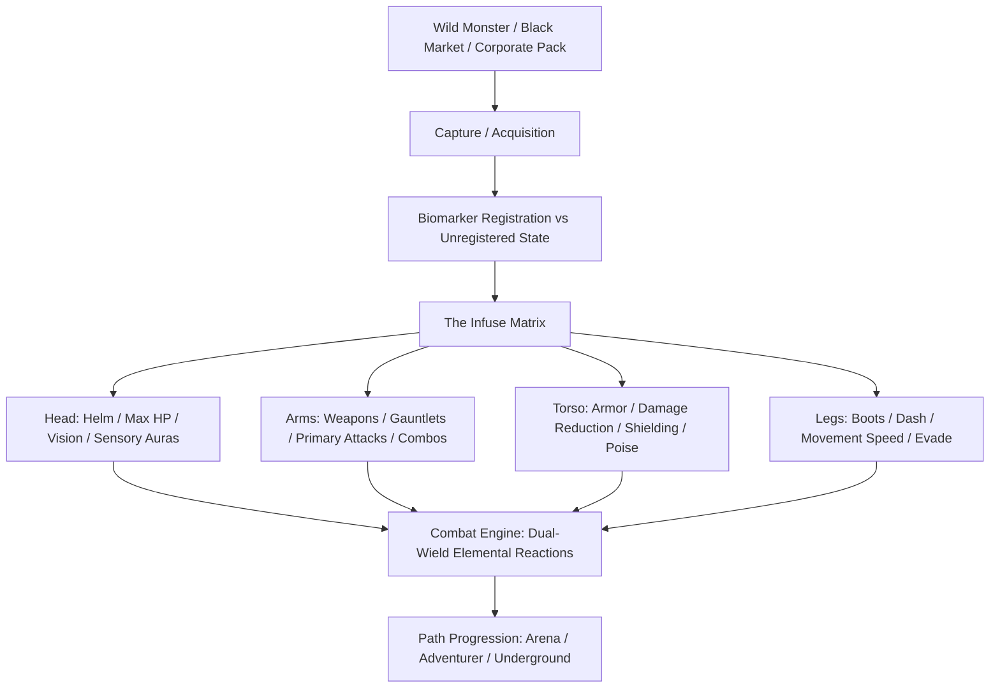
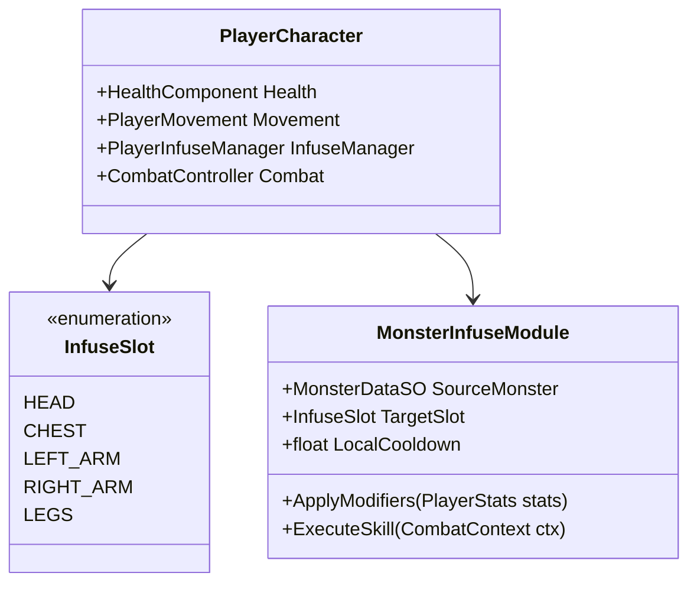
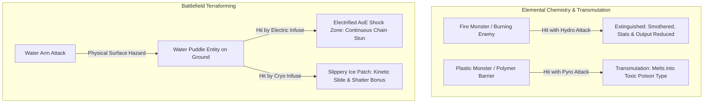
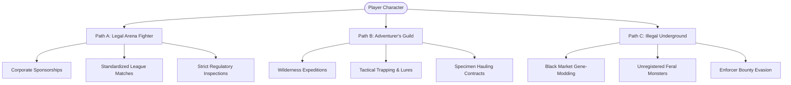
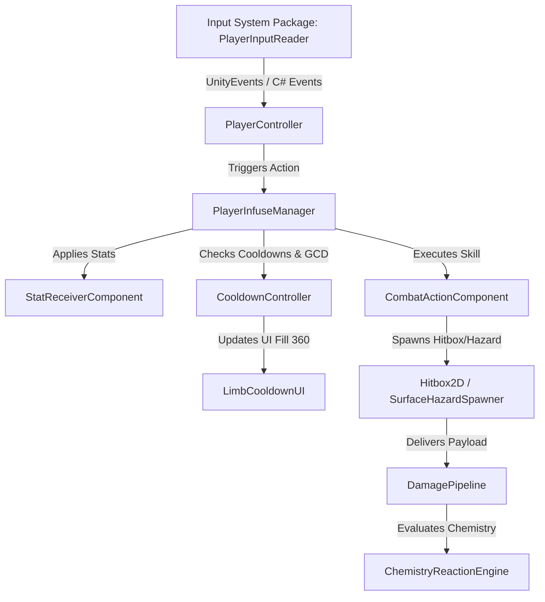

# BeastClad: Core Game Design Document (GDD)
**Project Codename:** BeastClad  
**Genre:** 2D Top-Down Sandbox Action-RPG  
**Engine & Tech Stack:** Unity (Universal Render Pipeline 2D, New Input System, Data-Driven ScriptableObject Architecture)  
**Target Platform:** PC / Consoles  
**Document Version:** 1.0.0  

---

## Executive Summary & Vision

**High Concept:** *"Monsters are not your companions or pets—they are your armor, your weapons, and your leverage in a broken world."*

In **BeastClad**, humanity does not form sentimental bonds with magical beasts to fight polite stadium bouts. In this grim, corporatized dystopia, monsters are an elite-monopolized bio-resource. The player operates in a 2D top-down sandbox where combat is defined by the **Infuse Mechanic**: captured beasts are bio-mechanically fused into the player's equipment slots (Head, Torso, Arms, Legs), directly conferring their physical forms, elemental affinities, and combat traits to the protagonist.

Progress is defined by **horizontal mastery, build synergy, and socioeconomic survival** across three divergent paths: the glittering, sponsored circuits of the **Legal Arena**, the rugged wilderness contracts of the **Adventurer's Guild**, or the lawless, lucrative underbelly of the **Illegal Underground**.



---

## 1. World & Setting: The "American Dream" Illusion

### 1.1 The Dystopian Socio-Economic Landscape
The world of *BeastClad* is centered around the metropolis of **Aethelgard** and its decaying perimeter sectors. Once celebrated as the golden frontier of bio-harnessing technology, society has stratified into an extreme caste system:
- **The Apex Class (The High Spire):** Corporate oligarchs, monopolistic bio-tech conglomerates (notably *Aegis-Fauna Corp*), and aristocratic dynasties who own exclusive mineral rights, breeding facilities, and legislative bodies. To them, rare beasts are luxury assets, designer guard dogs, and tax-sheltered status symbols.
- **The Rust Fringes & Slums:** The disenfranchised majority living on corporate debt and scrap ecology. For them, monster infusion is either an unattainable fantasy or an outlawed survival tool.
- **The "American Dream" Myth:** State-sponsored media constantly broadcasts the fairy tale of the "Self-Made Cladfighter"—the lie that any gutter-born youth with enough grit can capture a beast, climb the corporate arena ranks, and enter high society. In reality, the regulatory machine is rigged to ensure peasant fighters remain indebted combat entertainment.

### 1.2 The State Biomarker Registry & Legal Apparatus
Monsters are classified as **Class-A Controlled Bio-Armaments**.
- **State Registration (The Bio-Tag):** Every legally recognized monster possesses a cryptographically encrypted micro-tag surgically embedded into its core. This tag links the creature to a certified citizen license number.
- **Licensing Tiers:**
  - *Tier 0 (Civic):* Domestic utility only (farming, construction). Combat infusion is strictly illegal.
  - *Tier I–III (League Certified):* Graded for sanctioned arena combat with regulated output limits.
  - *Tier IV (Executive / Military):* Unrestricted combat capabilities reserved for corporate security details and elite champions.
- **The Crime of "Feral Infusion":** Using an unregistered, wild-caught, or black-market monster in combat within city limits is classified as **High Bio-Felony**. Enforcers utilize drone scanners to detect uncalibrated bio-signatures. Caught offenders face asset forfeiture, debt enslavement, or immediate liquidation.

### 1.3 Corporate "Starter Packs" vs. The Wild Trapping Reality
The socio-economic divide is most visible in how fighters acquire their armaments:

| Dimension | Corporate "Starter Packs" | Wild / Traditional Trapping |
| :--- | :--- | :--- |
| **Target Demographic** | Wealthy heirs, sponsored corporate prodigies. | Outlaws, drifters, fringe trappers, the desperate. |
| **Acquisition Method** | Showrooms, catalogs, direct bank wire transfer. | High-risk wilderness tracking, lures, mechanical snares, sedative darts. |
| **Specimen Profile** | Docile, genetically tailored, aesthetically pristine, sterile. | Feral, scarred, unpredictable, possessing raw survival traits. |
| **Systemic Drawback** | Heavily DRMed; performance caps locked behind subscription upgrades. | Completely illegal to use in civil zones; high risk of catastrophic backlash. |
| **Socioeconomic Impact** | Reinforces corporate reliance; safe, uniform, sterile combat. | True freedom; unlocks volatile, cross-hybridized combat potential. |

---

## 2. Core Combat System: The "Infuse" Architecture (CRITICAL)

### 2.1 The Core Paradigm: Biological Weaponization
> **CRITICAL RULE:** Monsters **DO NOT** fight independently as pawns, autonomous AI companions, or squad members on the battlefield. There are no separate monster health bars, no creature command menus, and no pet AI.
>
> In *BeastClad*, captured monsters are bio-mechanically and bio-organically **infused** directly into the player character's anatomy as living armor, biological appendages, and elemental armaments. Slotted monsters biologically wrap around the player's chassis, transforming their sprite layering, physical stats, moveset, and elemental traits.

```
[ Traditional Monster Battler ]          [ BeastClad Infuse System ]
  Player (Commander)                       Player Character
      │                                       ├── Head Slot      <== [Cinder Wyrm]    (HP Boost + Purge Utility)
      ▼                                       ├── Chest Slot     <== [Ironhide Boar]  (Defense Boost + Barrier Shield)
  Monster (Autonomous AI Combatant)           ├── Left Arm Slot  <== [Torrent Eel]    (Attack Boost + Water Slash)
                                              ├── Right Arm Slot <== [Volt Mantis]    (Attack Boost + Electric Stinger)
                                              └── Legs Slot      <== [Gale Hare]      (Speed Boost + Slipstream Dash)
```

### 2.2 Anatomical Infuse Slots & Build Synergy
The player loadout is built on a modular five-socket bio-chassis (Head, Chest, Left Arm, Right Arm, Legs), creating deep horizontal progression and customizable build synergies:



1. **Head Slot (Helm / Visor / Horns / Sensory Crest):**
   - **Stat Profile:** Boosts **Hit Points (Max HP Pool)** and Vitality scaling.
   - **Active/Passive Skill:** Defensive utility skills, debuff cleanses, threat scanning, and sensory HUD reveals (revealing hidden hazards, enemy elemental affinities, and poise thresholds).
   - *Example:* Infusing a *Specter Owl* head grants +45 Max HP and an active echolocation screech that dispels cloaking and temporarily disorients nearby foes.

2. **Chest Slot (Cuirass / Carapace / Core Shielding):**
   - **Stat Profile:** Boosts **Defense** (Flat Damage Reduction, Poise / Stagger Resistance).
   - **Active/Passive Skill:** Shielding skills, reactive armor barriers, damage absorption shells, and parry/deflection pulses.
   - *Example:* Infusing an *Ironhide Boar* chest grants heavy armor rating and an active defensive barrier skill that absorbs 150 incoming damage, detonating into a radial concussive blast when depleted.

3. **Arms Slots (Dual Modular: Left Arm & Right Arm):**
   - **Stat Profile:** Boosts **Attack Power**, Attack Speed, and Critical Strike Chance.
   - **Active/Passive Skill:** Primary damage moves, weapon archetypes (slashing blades, crushing fists, bio-projectiles, piercing stingers), and elemental strikes.
   - **Dual-Wielding Combo Freedom:** Players can independently equip *different* monsters to the Left Arm and Right Arm (e.g., Left Arm = Water Cleave; Right Arm = Electric Stinger). This enables seamless two-button attack chains and rapid elemental chemistry setups.

4. **Legs Slot (Greaves / Talons / Treads / Kinetic Springs):**
   - **Stat Profile:** Boosts **Movement Speed**, Acceleration, and Turn Rate.
   - **Active/Passive Skill:** Dash and mobility skills, evasive maneuvers (i-frame dodges, phase shifts, toxic slides), and ground traversal.
   - *Example:* Infusing a *Gale Hare* boosts base run speed by 25% and replaces standard rolling with a zero-friction slipstream dash that phases through enemy hitboxes.

### 2.3 Real-Time Action with Cooldowns (No Stamina, No Turn-Based Menus)
Combat is fluid, real-time top-down action designed for skill expression and rhythmic execution.
- **Strictly NO Stamina Bar:** The player is never penalized with sluggish overexertion, exhaustion pauses, or movement lockouts from sprinting or attacking.
- **Strictly NO PP (Power Points) or Mana:** No artificial consumable skill points or turn-based action menus.
- **Local Limb Cooldowns:**
  - Every equipped monster/limb has its own independent cooldown timer.
  - *Tactical Rotation:* Players are encouraged to continuously rotate through their limbs—firing a Left Arm strike, following with a Right Arm finisher, popping a Chest barrier, and executing a Leg dash while earlier limbs recharge.
  - Cooldown durations are strictly data-driven via ScriptableObjects (e.g., Left Arm Slash: 0.8s; Right Arm Heavy Strike: 1.5s; Legs Dash: 3.0s; Chest Shield: 6.0s; Head Utility: 8.0s).
- **Global Cooldown (GCD):**
  - A brief global cooldown (e.g., 0.5 seconds) applies across all limbs immediately following any skill activation.
  - *Purpose:* Establishes a crisp, deliberate combat cadence, enforces rhythmic decision-making, and strictly prevents chaotic simultaneous button-mashing.

### 2.4 Elemental Chemistry & Battlefield Terraforming
*BeastClad* eliminates flat, boring numerical damage multipliers (e.g., "Water deals 2x damage against Fire"). Instead, combat revolves around an organic **Chemistry and Battlefield Terraforming Engine**.



#### 1. Elemental Chemistry (Status Interactions & Transmutation):
- **Extinguishing & Debuffing:** Hitting a Fire-type beast or burning target with a Water-type attack physically extinguishes their flames, immediately smothering their heat aura and dramatically dropping their offensive attack stats.
- **Transmutation (e.g., Plastic + Fire = Poison):** Hitting a synthetic or polymer/Plastic-type monster with a Fire attack melts its outer carapace, transmuting it into a caustic **Poison-type**. The melted plastic emits toxic gas clouds and causes adjacent foes to suffer chemical poisoning.
- **Corrosion (Bio/Acid + Earth/Metal):** Applying acid strikes to heavily armored mineral or metal beasts dissolves their plating, turning high poise/armor into brittle vulnerability.

#### 2. Battlefield Terraforming (Physical Hazard Generation):
Attacks physically alter the floor geometry of the arena by spawning persistent 2D surface hazard entities:
- **Water Puddles:** Water-infused attacks leave conductive puddles of water across the arena floor.
- **Electrified Shock Zones:** Striking a water puddle with an Electric arm-infuse instantly electrifies the entire puddle surface, creating a localized AoE shock zone that chain-stuns and continuously damages anyone caught inside.
- **Flammable Oil Slicks:** Toxin/Oil attacks coat the ground in slicks. Any stray spark or flame attack ignites the slick into an advancing wall of fire, cutting off enemy approach vectors.
- **Cryo Ice Sheets:** Frost attacks freeze standing water puddles into slippery ice patches, altering entity movement physics and setting up heavy blunt shattering strikes.

### 2.5 Horizontal Progression over Vertical Stat Grinding
Progression is achieved through player skill, system mastery, and build composition rather than endless vertical stat inflation:
- **Build Synergy:** Finding complementary limb pairings (e.g., Hydro Left Arm + Volt Right Arm for self-sufficient terraformed puddle shock combos).
- **Mastery of Limb Rotation:** Perfecting the timing between local cooldowns and the 0.5s Global Cooldown (GCD).
- **Encounter Adaptability:** Swapping monster modules to counter regional elemental hazards and exploit enemy chemistry weaknesses.
- **Zero Stat Power-Creep:** Early-game captured beasts remain viable throughout the game due to their unique utility skills, elemental tags, and terraforming signatures.
---

## 3. Non-Linear Sandbox Paths (Player Freedom)

The game provides no single mandatory linear narrative track. Players choose how to carve out their existence in the socio-economic ecosystem.



### 3.1 Path A: The Legal Arena Fighter
- **Core Loop:** Enter sanctioned district tournaments, earn corporate sponsorships, satisfy television broadcast contracts, climb division ladders (Bronze, Silver, Gold, Apex).
- **Gameplay Dynamics:**
  - *Corporate Scrutiny:* Every piece of equipped beast gear is scanned before entering the ring. Using unregistered parts or illegal bio-mods results in instant disqualification and fines.
  - *Starter Pack Synergy:* Players optimize pre-packaged corporate breeds, exploiting standardized manufacturer bonuses (e.g., equipping full *Aegis-Fauna Mk-IV* sets yields exclusive corporate defensive barriers).
  - *Media & Crowd Favor:* Winning matches with theatrical flair (high-reaction combos, close dodges) raises the player’s **Hype Rating**, unlocking lucrative equipment contracts, press access, and high-society invitations.

### 3.2 Path B: The Adventurer's Guild
- **Core Loop:** Venture past the border walls into the untamed quarantine zones, dense primordial forests, and toxic marshes to trap wild specimens, fulfill resource bounties, and map uncharted ruins.
- **Gameplay Dynamics:**
  - **Tactical Trapping Mechanics:** Wild beasts cannot be casually harvested. Players must engage in methodical field prep:
    - *Lures & Pheromone Baits:* Laying tailored scent tracks to bait apex predators away from their pack.
    - *Environmental Traps:* Placing electro-nets, pitfall cages, cryo-traps, and tranquilizer stakes.
    - *Subdual & Sedation:* Weakening the beast's poise without killing it, then administering containment capsules before tissue degradation sets in.
  - **Transport & Logistics:** Captured live specimens are bulky and heavy. Players must protect their transport sleds/haulers from rival scavengers and wild packs during the trek back to town.
  - **Scientific Supply Chain:** Sell specimens to research institutes, medical labs, or the guild to expand world knowledge, unlock field blueprints, and obtain survival rations.

### 3.3 Path C: The Illegal Underground
- **Core Loop:** Delve into the subterranean aqueducts, abandoned subway networks, and back-alley speakeasies where state law does not reach. Trade in black-market bio-parts, partake in no-holds-barred death matches, and execute criminal contracts.
- **Gameplay Dynamics:**
  - **Unregistered & Abused Monsters:** Black-market beasts are tortured, hyper-mutated, or pumped with synthetic adrenaline:
    - *Volatile Overclock Stats:* Unregistered beasts provide massive stat boosts (e.g., +150% Attack Speed) but carry severe mechanical penalties: sudden equipment failure, self-inflicted damage, or madness meters that invert player controls.
    - *Chimera Stitching:* Back-alley ripperdocs will illegally fuse incompatible monster parts together, producing aberrant gear with chaotic reaction profiles.
  - **Underground Betting & Match Fixing:** Bet on your own fights, orchestrate intentional dives for syndicate bookies, or eliminate high-value targets in the pit.
  - **The Enforcer Heat System:** Operating illegal gear inside municipal zones raises the player's **Heat Level**. High heat triggers armed corporate kill-squads and state bounty hunters patrolling the streets.

### 3.4 Cross-Path Emergence
The sandbox does not lock the player into a single lane. A player may:
- Fund their legal arena entry fees by trapping rare beasts in the wilderness.
- Use an arena champion's legitimate media pass to smuggle high-grade black-market bio-weapons past municipal checkpoints.
- Use underground ripperdoc mods to covertly tamper with a corporate starter pack monster, cheating past arena scanners through holographic masking.

---

## 4. Technical Architecture Rules (Unity C#)

To guarantee scalability, eliminate tech debt, and adhere strictly to the project's development standards, all engineering on *BeastClad* must follow these architectural rules.

### 4.1 Data-Driven Design with ScriptableObjects
**Absolute Mandate:** No combat values, monster statistics, elemental damage multipliers, cooldown durations, or equipment socket rules may ever be hardcoded into `MonoBehaviour` classes. All parameters MUST be driven by Unity `ScriptableObject` assets.

```
Assets/
├── Data/
│   ├── Monsters/           # MonsterDataSO instances (Species, base stats, visual assets)
│   ├── Elements/           # ElementalTypeSO & ChemistryMatrixSO
│   ├── Infuse/             # InfusePartSO (Socket profiles, local cooldowns, active skills)
│   ├── Skills/             # SkillDefinitionSO (Hitboxes, damage frames, terraforming prefabs)
│   ├── Terraforming/       # SurfaceHazardSO (Puddle, Fire, Shock Zone definitions)
│   └── Items/              # Traps, Lures, Consumables
```

#### Core Data Architecture Schema:

```csharp
// Enumeration of all player bio-sockets
public enum EquipmentSlot
{
    Head,
    Chest,
    LeftArm,
    RightArm,
    Legs
}

// The single source of truth for an individual monster species
[CreateAssetMenu(fileName = "NewMonsterData", menuName = "BeastClad/Data/Monster Data")]
public class MonsterDataSO : ScriptableObject
{
    [Header("Identity & Registration")]
    public string speciesId;
    public string commonName;
    public RegistrationStatus defaultRegistration; // Legal, Unregistered, Contraband
    
    [Header("Elemental Affinities")]
    public ElementalTypeSO primaryElement;
    public ElementalTypeSO secondaryElement;

    [Header("Infuse Socket Adaptations")]
    public InfusePartSO headModule;
    public InfusePartSO chestModule;
    public InfusePartSO leftArmModule;
    public InfusePartSO rightArmModule;
    public InfusePartSO legsModule;
}

// Defines behavior and stats when slotted into a specific body part
[CreateAssetMenu(fileName = "NewInfusePart", menuName = "BeastClad/Data/Infuse Part")]
public class InfusePartSO : ScriptableObject
{
    [Header("Socket Configuration")]
    public EquipmentSlot targetSlot;
    
    [Header("Cooldown Durations (Mandatory SO Data)")]
    [Tooltip("Independent local cooldown for this limb skill (seconds).")]
    public float localCooldownDuration = 1.0f;
    
    [Header("Stat Modifiers")]
    public StatModifierGroup statModifiers;
    
    [Header("Visuals & Moveset")]
    public Sprite visualOverlaySprite;
    public RuntimeAnimatorController animatorOverride;
    public SkillDefinitionSO activeSkill;
    public List<PassiveTraitSO> passiveTraits;
}
```

- **Separation of Definition and State:**
  - `MonsterDataSO` represents the static template (immutable asset).
  - `MonsterInstance` (pure C# class, non-MonoBehaviour) represents the runtime instance (current stability, mutation level, registration certificate ID, durability).

### 4.2 Decoupled Component Architecture & Vibe Coding Guidelines
Systems must communicate via interfaces, explicit dependencies, or ScriptableObject-based event channels. No God-classes.



#### Architectural & Implementation Rules:
1. **Input System Standard (Mandatory):**
   - Strictly utilize Unity's **New Input System Package** (`com.unity.inputsystem`).
   - Actions are mapped cleanly via a dedicated `PlayerInputReader` (or C# generated actions wrapper):
     - `Move` (Vector2 - Left Stick / WASD)
     - `LeftArmAttack` (Button - Left Mouse / Gamepad West)
     - `RightArmAttack` (Button - Right Mouse / Gamepad North)
     - `ChestSkill` (Button - Spacebar / Gamepad South / Left Shoulder)
     - `HeadSkill` (Button - Q / Gamepad East)
     - `LegsDash` (Button - Left Shift / Gamepad Right Trigger)
   - Do NOT introduce legacy `UnityEngine.Input` calls anywhere in the project.

2. **UI Feedback Guidelines (Radial 360 Fill Cooldowns):**
   - All limb cooldowns (Head, Chest, Left Arm, Right Arm, Legs) must be visibly communicated to the player on the combat HUD.
   - **Radial 360 Fill Method:** The UI cooldown indicator MUST use a Unity UI `Image` component configured with:
     - `Image Type = Filled`
     - `Fill Method = Radial 360`
     - `Fill Origin = Top` (or appropriate orientation)
     - `Fill Clockwise = false` (or true, consistently draining or filling)
   - Visual States:
     - **On Cooldown:** Fill amount transitions dynamically from `1.0f` down to `0.0f` as the timer elapses.
     - **On GCD:** A brief pulse/overlay indicates the universal 0.5s Global Cooldown across inactive limbs.
     - **Ready:** When `Fill == 0.0f`, a subtle highlight flash/sheen communicates immediate availability.

3. **Combat Pipeline & Chemistry Resolution:**
   - Hitboxes emit a `DamagePayload` struct containing: `rawPhysicalDamage`, `elementalType`, `chemistryReactionUnits`, `poiseDamage`, `attackerSource`.
   - The receiving `Hurtbox2D` passes the payload into a decoupled `DamagePipeline`.
   - The `ChemistryReactionEngine` processes status extinguishment (e.g., Fire extinguished by Water) or transmutation (e.g., Plastic melted by Fire into Poison) without hardcoded switch tables.
   - Terraforming hazards (e.g., water puddles, oil slicks) are spawned as separate 2D trigger colliders that query elemental hitboxes to trigger terrain reactions (e.g., Electric arm hitting Water puddle spawns AoE shock hazard).

4. **No Direct Component Coupling:**
   - The UI does not poll the player character directly in `Update()`. UI binds to C# events (e.g., `OnLimbCooldownUpdated(EquipmentSlot slot, float normalizedTime)`, `OnInfuseChanged`, `OnHealthModified`).
   - The Inventory/Loadout system communicates with the visual rendering system via an `OnEquipmentVisualsDirty` event.

### 4.3 Validation & Unity MCP Workflow
- All newly added components must pass automated validation checks using Unity MCP tools.
- Never use external `dotnet` CLI commands to compile or validate Unity scripts; use the project's configured Unity MCP pipeline.
- Maintain clean `.meta` file hygiene: let Unity generate and manage all metadata files automatically.

---

## 5. Visual & Audio Aesthetic Direction

- **Visual Style:** High-contrast 2D pixel art / stylized 2D sprites lit via Unity's Universal Render Pipeline (URP) 2D Lighting (normal maps, emissive elemental glows, dynamic point lights).
- **Aesthetic Contrast:**
  - *The Legal Arenas:* Neon holographic signage, chrome polished floors, corporate sponsor banners, spotless high-tech medical bays.
  - *The Rust Fringes & Wilds:* Desaturated industrial decay, muddy rain-soaked trenches, dense bioluminescent flora, overgrown concrete ruins.
  - *The Underground:* Dim tungsten spotlights, flickering neon bar signs, blood-stained concrete pits, improvised operating tables.
- **Audio Palette:**
  - Gritty industrial synth-rock combined with visceral organic sound design.
  - The sound of Infusing is heavy and visceral: biological flesh locking into steel latches, mechanical servos engaging as beast bone snaps into combat readiness.

---

## 6. Development Milestones & Roadmap

| Phase | Milestone Name | Key Deliverables |
| :--- | :--- | :--- |
| **Phase 1** | **Core Infuse Prototype** | Top-down 2D controller (New Input System), 4-slot Infuse Manager, basic attack combo & dash with 2 swappable monster data sets. |
| **Phase 2** | **Reaction Engine & Trapping** | Full 5-element matrix, elemental reaction status resolver, lure placement, snare trap subdual mechanic. |
| **Phase 3** | **Sandbox Verticals** | 1 functional Legal Arena bout, 1 wilderness hunting zone with specimen hauler loop, 1 underground black-market ripperdoc hub. |
| **Phase 4** | **Content Expansion & Economy** | 20 unique `MonsterDataSO` assets, registration scanning AI, dynamic district heat system, full audio integration. |

---

*End of Core Game Design Document — BeastClad.*
